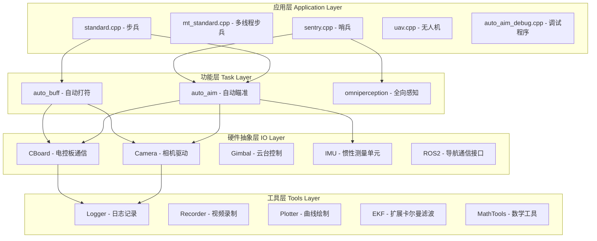
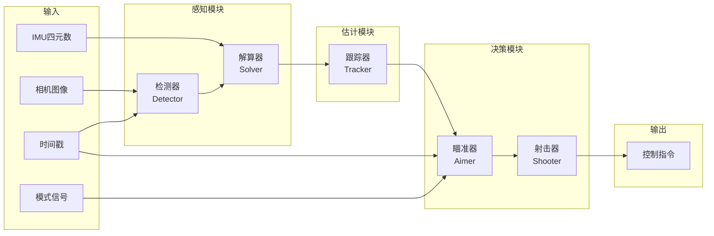

# sp_vision_25 项目架构分析

## 1. 项目概述

### 1.1 项目简介
sp_vision_25 是同济大学 SuperPower 战队 2025 赛季的视觉算法开源项目，主要用于 RoboMaster 机器人竞赛中的自动瞄准（Auto-Aim）和自动打符（Auto-Buff）功能。

### 1.2 核心亮点
- **无ROS依赖**：新同学无需学习ROS相关知识就能上手自瞄
- **完整工作流**：包含开发、编译、调试、部署全流程
- **模块化架构**：各模块功能明确，便于开发和维护
- **创新算法**：提出"轨迹视角下的自瞄理论"，设计"自瞄轨迹规划算法"

### 1.3 技术指标
- 帧率：约 100 FPS
- 命中率：最高 39.6%，正常发挥不低于 30%
- 击杀时间：7rad/s 转速下约 8s，14rad/s 转速下约 10s（2m 距离，300HP）

---

## 2. 软件架构层次

### 2.1 架构概览

项目采用分层架构设计，自下而上分为四层：



### 2.2 各层详细说明

#### 2.2.1 应用层 (Application Layer)
位于 `src/` 目录，包含不同兵种的主程序入口：

| 程序文件 | 功能描述 | 适用兵种 |
|---------|---------|---------|
| [`standard.cpp`](src/standard.cpp) | 单线程步兵主程序 | 步兵 |
| [`mt_standard.cpp`](src/mt_standard.cpp) | 多线程步兵主程序 | 步兵 |
| [`standard_mpc.cpp`](src/standard_mpc.cpp) | 使用MPC的步兵程序 | 步兵 |
| [`sentry.cpp`](src/sentry.cpp) | 哨兵主程序 | 哨兵 |
| [`uav.cpp`](src/uav.cpp) | 无人机主程序 | 无人机 |
| [`auto_aim_debug.cpp`](src/auto_aim_debug.cpp) | 自瞄调试程序 | 调试 |

#### 2.2.2 功能层 (Task Layer)
位于 `tasks/` 目录，实现具体功能算法：

**auto_aim - 自动瞄准模块**
- [`detector.cpp/hpp`](tasks/auto_aim/detector.cpp) - 装甲板检测器
- [`tracker.cpp/hpp`](tasks/auto_aim/tracker.cpp) - 目标跟踪器
- [`aimer.cpp/hpp`](tasks/auto_aim/aimer.cpp) - 瞄准决策器
- [`shooter.cpp/hpp`](tasks/auto_aim/shooter.cpp) - 射击决策器
- [`solver.cpp/hpp`](tasks/auto_aim/solver.cpp) - 位姿解算器
- [`classifier.cpp/hpp`](tasks/auto_aim/classifier.cpp) - 装甲板分类器
- [`voter.cpp/hpp`](tasks/auto_aim/voter.cpp) - 投票器
- [`yolo.cpp/hpp`](tasks/auto_aim/yolo.cpp) - YOLO检测模型接口
- `planner/` - 轨迹规划器（MPC算法）
- `yolos/` - YOLO模型实现（v5/v8/v11）

**auto_buff - 自动打符模块**
- [`buff_detector.cpp/hpp`](tasks/auto_buff/buff_detector.cpp) - Buff检测器
- [`buff_target.cpp/hpp`](tasks/auto_buff/buff_target.cpp) - Buff目标跟踪
- [`buff_aimer.cpp/hpp`](tasks/auto_buff/buff_aimer.cpp) - Buff瞄准器
- [`buff_solver.cpp/hpp`](tasks/auto_buff/buff_solver.cpp) - Buff解算器
- [`yolo11_buff.cpp/hpp`](tasks/auto_buff/yolo11_buff.cpp) - YOLO11 Buff检测

**omniperception - 全向感知模块**
- `perceptron.cpp/hpp` - 全向感知核心
- `decider.cpp/hpp` - 决策器

#### 2.2.3 硬件抽象层 (IO Layer)
位于 `io/` 目录，封装硬件接口：

| 模块 | 功能 | 支持硬件 |
|-----|------|---------|
| [`camera.cpp/hpp`](io/camera.cpp) | 相机驱动 | 海康MV-CS016-10UC、MindVision、USB摄像头 |
| [`cboard.cpp/hpp`](io/cboard.cpp) | 电控板通信 | RoboMaster C板（STM32F407） |
| [`gimbal.cpp/hpp`](io/gimbal/gimbal.cpp) | 云台控制 | 串口通信 |
| [`dm_imu.cpp/hpp`](io/dm_imu/dm_imu.cpp) | IMU数据读取 | 达妙BMI088 |
| [`ros2/`](io/ros2/) | ROS2接口 | 导航通信 |

#### 2.2.4 工具层 (Tools Layer)
位于 `tools/` 目录，提供通用工具函数：

| 工具 | 功能 |
|-----|------|
| [`logger.cpp/hpp`](tools/logger.cpp) | 日志记录（spdlog封装） |
| [`recorder.hpp`](tools/recorder.hpp) | 视频录制器 |
| [`plotter.cpp`](tools/plotter.cpp) | PlotJuggler曲线绘制 |
| [`extended_kalman_filter.hpp`](tools/extended_kalman_filter.hpp) | 扩展卡尔曼滤波器 |
| [`math_tools.hpp`](tools/math_tools.hpp) | 数学工具（四元数、欧拉角等） |
| [`img_tools.hpp`](tools/img_tools.hpp) | 图像处理工具 |
| [`pid.hpp`](tools/pid.hpp) | PID控制器 |
| [`trajectory.hpp`](tools/trajectory.hpp) | 弹道解算 |
| [`yaml.hpp`](tools/yaml.hpp) | YAML配置文件解析 |

---

## 3. 数据流图

### 3.1 自瞄数据流



### 3.2 数据流详细说明

1. **图像获取阶段**
   - 相机线程从相机获取图像和时间戳
   - 通过下位机线程获取对应的云台姿态四元数

2. **检测阶段**
   - 图像经过检测器，获得装甲板的四个顶点像素坐标
   - 获得装甲板图案类别

3. **解算阶段**
   - 根据装甲板信息和云台姿态，计算目标在世界坐标系中的位置

4. **跟踪阶段**
   - 估计器根据装甲板信息，获得目标单位的运动状态
   - 使用扩展卡尔曼滤波进行状态估计

5. **决策阶段**
   - 决策器根据目标运动状态，预测目标的运动轨迹
   - 判断最佳瞄准位置和最佳开火时机

6. **执行阶段**
   - 形成指令发送给下位机
   - 控制器和执行机构根据指令执行

---

## 4. 核心算法

### 4.1 轨迹视角下的自瞄理论

#### 4.1.1 理论基础

传统自瞄决策器存在的问题：
- 决策器实现繁琐，不同兵种、不同敌方移动状态需要不同的代码实现
- 控制调参困难，缺乏理论指导

轨迹视角下的自瞄理论：
- **目标轨迹**：`yaw_target(t)` - 目标相对于云台的方位角
- **云台轨迹**：`yaw_gimbal(t)` - 云台相对于初始位置的夹角
- **射击轨迹**：`yaw_shoot(t) = yaw_target(t + t_fly)` - 考虑子弹飞行时间的目标轨迹

#### 4.1.2 轨迹规划器

**核心思想**：通过优化射击轨迹，使其更容易被云台跟随

**提前减速策略**：
- 小陀螺时装甲板会发生切换，导致轨迹突变
- 提前减速向下一个装甲板过渡
- 使规划后轨迹的加速度小于云台最大加速度

**实现方案**：
1. **隐式搜索**：使用TinyMPC库求解二次规划问题
2. **显式搜索**：使用五次多项式生成过渡段轨迹

#### 4.1.3 开火决策

考虑开火延迟时间 `t_fire`：
- 查询 `t_fire` 时刻射击轨迹和对应规划后轨迹的误差
- 判断经过 `t_fire` 时间后子弹是否应该出膛

### 4.2 Buff检测与EKF跟踪系统

#### 4.2.1 YOLO11检测模块

**检测网络输出格式 `[15, 8400]`**：
```
[0-3]:   边界框参数 [cx, cy, ow, oh]
[4]:     置信度分数
[5-14]:  6个关键点坐标 (x1,y1,x2,y2,...x6,y6)
```

**检测流程**：
1. 图像预处理：Letterbox变换保持宽高比
2. 模型推理：OpenVINO框架CPU推理
3. 后处理：置信度阈值筛选 + NMS
4. 坐标映射：将检测结果映射回原图

#### 4.2.2 EKF运动预测模块

**小符模型（SmallTarget）**：
- 状态向量（7维）：`[R_yaw, v_R_yaw, R_pitch, R_dis, yaw, angle, spd]`
- 恒定角速度：`CV_PI/3 rad/s` (约1.047 rad/s)
- 角速度方向检测：使用Voting机制判断顺逆时针

**大符模型（BigTarget）**：
- 状态向量（10维）：`[R_yaw, v_R_yaw, R_pitch, R_dis, yaw, angle, spd, a, w, fi]`
- 正弦速度模型：`spd = a*sin(w*t + fi) + 2.09 - a`
- 参数范围：`a∈[0.78,1.045], w∈[1.884,2.000]`

---

## 5. 技术栈

### 5.1 编程语言
- C++17

### 5.2 核心依赖库

| 库 | 版本 | 用途 |
|---|------|------|
| OpenCV | - | 图像处理 |
| OpenVINO | 2024.6.0 | 神经网络推理 |
| Eigen3 | - | 线性代数运算 |
| spdlog | - | 日志记录 |
| yaml-cpp | - | 配置文件解析 |
| fmt | - | 格式化输出 |
| nlohmann_json | - | JSON处理 |
| Ceres | - | 非线性优化（标定） |

### 5.3 硬件平台

| 组件 | 型号 |
|-----|------|
| 运算平台 | NUC12WSKI7（i7-1260P，16GB） |
| 相机 | 海康MV-CS016-10UC |
| 镜头 | 海康官方6mm镜头 |
| 下位机 | RoboMaster开发板C型（STM32F407） |
| IMU | BMI088 |
| 通信 | USB2CAN / MicroUSB虚拟串口 |

---

## 6. 编译与部署

### 6.1 编译方式

```bash
# 安装依赖
sudo apt install -y git g++ cmake can-utils libopencv-dev libfmt-dev \
    libeigen3-dev libspdlog-dev libyaml-cpp-dev libusb-1.0-0-dev \
    nlohmann-json3-dev openssh-server screen

# 编译
cmake -B build
cmake --build build

# 运行demo
./build/auto_aim_test
```

### 6.2 可执行程序

**应用层程序**：
- `standard` - 步兵主程序
- `mt_standard` - 多线程步兵
- `sentry` - 哨兵（需要ROS2环境）
- `uav` - 无人机

**调试程序**：
- `auto_aim_debug_mpc` - 自瞄MPC调试
- `auto_buff_debug` - 打符调试
- `auto_buff_debug_mpc` - 打符MPC调试

**测试程序**：
- `camera_test` - 相机测试
- `cboard_test` - 电控板测试
- `gimbal_test` - 云台测试
- `detector_video_test` - 检测器视频测试
- `planner_test` - 规划器测试

**标定程序**：
- `capture` - 相机标定数据采集
- `calibrate_camera` - 相机内参标定
- `calibrate_handeye` - 手眼标定

---

## 7. 配置文件

配置文件位于 `configs/` 目录：

| 文件 | 适用场景 |
|-----|---------|
| `standard3.yaml` | 3号步兵 |
| `standard4.yaml` | 4号步兵 |
| `sentry.yaml` | 哨兵 |
| `uav.yaml` | 无人机 |
| `demo.yaml` | 演示模式 |
| `calibration.yaml` | 标定模式 |

---

## 8. 目录结构

```
sp_vision_25/
├── assets/              # 资源文件（模型权重、测试素材）
├── calibration/         # 标定程序
├── configs/             # YAML配置文件
├── io/                  # 硬件抽象层
├── src/                 # 应用层主程序
├── tasks/               # 功能层算法
│   ├── auto_aim/       # 自动瞄准
│   ├── auto_buff/      # 自动打符
│   └── omniperception/ # 全向感知
├── tests/               # 测试程序
├── tools/               # 工具库
├── CMakeLists.txt       # CMake配置
└── readme.md            # 项目说明
```

---

## 9. 未来优化方向

1. **轨迹规划器部署到更多兵种**：英雄、哨兵、无人机
2. **边跑边打**：引入轮式里程计信息
3. **GPU推理优化**：使用Intel GPU加速推理
